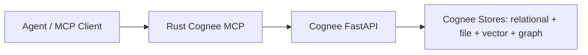

# Cognee Rust MCP Agent Memory Spec

## Decision

Build a Rust MCP server that talks to the Cognee FastAPI backend over HTTP and gives agents a fast, clean, workflow-shaped memory interface.

Do not rewrite Cognee into Rust.

Cognee remains the owner of ingestion, cognify pipelines, graph construction, vector search, graph search, auth, permissions, datasets, storage, and long-running pipeline state.

The Rust MCP is the agent-facing retrieval and control layer. Its job is to make Cognee memory easy for agents to use on the first pass.

## Core Principle

An MCP server for agents is not just an API wrapper. It is an information delivery system.

The server should not make the model assemble raw API records, chase opaque ids, or infer the next step. Each tool call should return a finished Markdown packet with:

- the direct answer,
- the evidence needed to trust it,
- stable continuation handles,
- explicit next navigation,
- source and coverage notes.

The agent should spend tokens using Cognee memory, not recovering the shape of Cognee memory.

## Latency Expectation

This MCP will not have the same latency floor as the Master Coach Mind SQLite server. Master Coach can return in about 5ms because it is a compiled Rust process over an already-open SQLite read model on stdio.

This Cognee MCP calls `reqwest -> Cognee FastAPI -> Python -> Cognee stores -> HTTP response`, so normal retrieval should be expected in the 50-200ms range depending on the backend and query. The v1 win is cleaner packets and fewer round trips, not a 5ms local read-model floor.

If HTTP/backend latency becomes the bottleneck, build a separate optional SQLite read-model bridge fed from Cognee exports or graph summaries.

## Goals

- Replace CLI/subprocess workflows with a Rust MCP interface.
- Make Cognee memory retrieval faster and cleaner for agents.
- Preserve Cognee as the backend source of truth.
- Expose small workflow-shaped tools, not one tool per endpoint.
- Return Markdown packets in `result.content[0].text`.
- Include exact continuation handles in every packet.
- Make long-running operations navigable through pipeline/status handles.
- Make destructive operations impossible to run accidentally.
- Keep the internal HTTP client broad enough to cover Cognee API capabilities deliberately.

## Non-Goals

- Do not rewrite Cognee in Rust.
- Do not run Cognee pipelines inside the MCP.
- Do not open SQLite, LanceDB, Ladybug, NetworkX, Kuzu, graph stores, vector stores, or Cognee internals directly.
- Do not import Python modules.
- Do not shell out to `uv run cognee-cli`.
- Do not expose admin, auth, permissions, notebook, sync, or UI workbench endpoints as default agent tools.
- Do not expose schema or ontology mutation as default agent tools.
- Do not return raw JSON blobs as the user-facing MCP result.

## Target Architecture



## Rust MCP Package

Name: `cognee-rust-mcp`

Primary binary:

- `cognee-mcp-rs`

Suggested crates:

- MCP transport: `rmcp` or current official Rust MCP SDK equivalent.
- HTTP: `reqwest`.
- Async runtime: `tokio`.
- JSON: `serde`, `serde_json`.
- Multipart: `reqwest::multipart`.
- CLI args/env config: `clap`.
- Error handling: `thiserror`, `anyhow`.
- Logging: `tracing`, `tracing-subscriber`.
- WebSocket status: `tokio-tungstenite` only if pipeline subscription is needed.

## Runtime Configuration

Required:

- `COGNEE_SERVICE_URL`, default `http://localhost:8000`.

Optional:

- `COGNEE_API_KEY`: send as `X-Api-Key`.
- `COGNEE_BEARER_TOKEN`: send as `Authorization: Bearer <token>`.
- `COGNEE_TENANT_ID`: send as `X-Tenant-Id`.
- `COGNEE_DATASET_NAME`: default dataset.
- `COGNEE_TIMEOUT_MS`: default HTTP timeout.
- `COGNEE_RETRIEVAL_TIMEOUT_MS`: shorter timeout for search/recall.
- `COGNEE_TOP_K`: default `10`, clamp `1..50`.
- `COGNEE_MCP_ENABLE_DESTRUCTIVE_TOOLS`: default `false`.
- `COGNEE_MCP_MAX_UPLOAD_BYTES`: required before reading large local files.

Auth header order:

1. If `COGNEE_API_KEY` exists, send `X-Api-Key`.
2. If `COGNEE_TENANT_ID` exists, also send `X-Tenant-Id`.
3. Else if `COGNEE_BEARER_TOKEN` exists, send bearer auth.
4. Else call local API unauthenticated and let Cognee backend policy apply.

## MCP Response Contract

Every agent-facing tool returns Markdown text in:

```text
result.content[0].text
```

Every packet must include:

```text
# Packet Title

## Answer

Direct result.

## Evidence

Tables, snippets, source rows, returned ids, pipeline status, or supporting data.

## Navigate Next

Exact next tool calls and stable handles.

## Source / Coverage

Cognee endpoint(s), dataset(s), search mode, limits, and caveats.
```

JSON may be returned only as secondary machine metadata if the MCP SDK supports structured content. It must not be the primary user-facing tool text.

## Stable Handles

Packets must carry every available continuation handle:

- `dataset_name`
- `dataset_id`
- `data_id`
- `pipeline_run_id`
- `search_type`
- `node_name`
- `ontology_key`
- `schema_id` or schema name when available
- source file name or raw data reference when available

If a tool cannot return a useful handle, the packet must say what is missing and which tool should be called next to get it.

## Default Agent Tool Surface

Expose a small workflow-shaped tool set by default:

```text
describe
get_status
remember
add
cognify
recall
search
inspect_dataset
inspect_graph
improve
forget
```

Do not expose a separate MCP tool for every Cognee HTTP endpoint. The Rust code can implement a broad typed HTTP client internally.

## Optional Operator Tool Surface

These tools are useful, but they are not default agent memory tools:

```text
manage_schema
manage_ontology
```

They must be hidden or disabled unless operator mode is explicitly enabled. Schema and ontology mutating actions require `confirm=true` and `COGNEE_MCP_ENABLE_DESTRUCTIVE_TOOLS=true`.

## Tool Requirements

### `describe`

Purpose: orient the agent to the Cognee memory surface.

Inputs:

```json
{}
```

Behavior:

- Check backend health.
- Show configured service URL.
- Show auth mode without leaking secrets.
- Show default dataset if configured.
- Show available public tools.
- Explain the packet contract.
- Give the recommended retrieval flow.

Navigate next:

- `search` when the agent has a question.
- `recall` when the agent wants memory-grounded answer synthesis.
- `inspect_dataset` when the agent needs dataset inventory.
- `get_status` when the backend or pipeline state is unclear.

API:

- `GET /health`
- optional `GET /api/v1/datasets`

### `get_status`

Purpose: answer "is Cognee ready, and what is running?"

Inputs:

```json
{
  "dataset_name": null,
  "dataset_id": null,
  "pipeline_run_id": null,
  "include_detailed_health": false
}
```

API:

- `GET /health`
- optional `GET /health/detailed`
- `GET /api/v1/datasets/status`
- optional `GET /api/v1/activity/pipeline-runs`

Packet must include:

- backend status,
- dataset status when requested,
- pipeline status when requested,
- exact next tool call.

### `remember`

Purpose: one-step memory write for small direct memory additions.

Inputs:

```json
{
  "data": "inline text or local file path",
  "dataset_name": null,
  "dataset_id": null,
  "node_set": [],
  "custom_prompt": null,
  "chunks_per_batch": 10,
  "run_in_background": false
}
```

API:

- `POST /api/v1/remember` multipart.

Behavior:

- If `data` is an existing local file path, upload the file.
- If `data` is inline text, upload as content-addressed `text_<hash>.txt`.
- Enforce `COGNEE_MCP_MAX_UPLOAD_BYTES`.
- Return dataset and data handles when Cognee provides them.
- Navigate to `recall`, `search`, `inspect_dataset`, or `get_status`.

### `add`

Purpose: stage data into a Cognee dataset without requiring the agent to use CLI commands.

Inputs:

```json
{
  "data": ["inline text or local file path"],
  "dataset_name": null,
  "dataset_id": null,
  "node_set": [],
  "run_in_background": false
}
```

API:

- `POST /api/v1/add` multipart.

Packet must include:

- staged item count,
- dataset handles,
- data handles when available,
- whether `cognify` is needed next.

### `cognify`

Purpose: build Cognee graph/vector memory from staged data.

Inputs:

```json
{
  "datasets": [],
  "dataset_ids": [],
  "run_in_background": true,
  "graph_model": null,
  "custom_prompt": null,
  "ontology_key": null,
  "chunks_per_batch": 10,
  "wait": false,
  "subscribe": false
}
```

API:

- `POST /api/v1/cognify`
- optional `WS /api/v1/cognify/subscribe/{pipeline_run_id}`
- fallback polling through `GET /api/v1/datasets/status`

Behavior:

- Default to background execution.
- Return `pipeline_run_id` when available.
- If `wait=true`, poll only up to the configured timeout.
- If the pipeline is still running, the packet must name the exact `get_status` call.
- Do not support Python `graph_model_file`; use API `graph_model` only.

### `recall`

Purpose: ask Cognee memory for a memory-grounded answer.

Inputs:

```json
{
  "query": "string",
  "datasets": [],
  "dataset_ids": [],
  "search_type": null,
  "scope": null,
  "system_prompt": "Answer using Cognee memory. Be concise and cite the available handles.",
  "node_name": [],
  "top_k": 10,
  "only_context": false,
  "verbose": false
}
```

API:

- `POST /api/v1/recall`
- optional `GET /api/v1/recall` for history if needed.

Packet must include:

- direct answer or retrieved context,
- result snippets,
- dataset/source handles,
- search settings used,
- next call to `search`, `inspect_graph`, or `inspect_dataset` when more precision is needed.

### `search`

Purpose: direct graph/vector/chunk search without answer synthesis.

Inputs:

```json
{
  "query": "string",
  "search_type": null,
  "datasets": [],
  "dataset_ids": [],
  "system_prompt": null,
  "node_name": [],
  "top_k": 10,
  "only_context": true,
  "verbose": false
}
```

API:

- `POST /api/v1/search`
- optional `GET /api/v1/search` for history if needed.

Known search types:

- `GRAPH_COMPLETION`
- `GRAPH_COMPLETION_COT`
- `RAG_COMPLETION`
- `CHUNKS`
- `SUMMARIES`
- `CODE`
- `CYPHER`
- `INSIGHTS`
- `TEMPORAL`
- `FEELING_LUCKY`

Behavior:

- Pass search types through as strings.
- Warn on unknown search types without blocking forward compatibility.
- Return compact ranked Markdown tables.
- Include exact next calls to `recall`, `inspect_graph`, or `inspect_dataset`.

### `inspect_dataset`

Purpose: give agents a clean inventory and status view of Cognee datasets and data.

Inputs:

```json
{
  "dataset_name": null,
  "dataset_id": null,
  "view": "summary|data|status|schema|raw",
  "data_id": null,
  "limit": 25,
  "save_raw_to_path": null
}
```

API:

- `GET /api/v1/datasets`
- `POST /api/v1/datasets` only when explicitly creating by name through a tool action
- `GET /api/v1/datasets/{dataset_id}/data`
- `GET /api/v1/datasets/status`
- `GET /api/v1/datasets/{dataset_id}/schema`
- `GET /api/v1/datasets/{dataset_id}/data/{data_id}/raw`

Behavior:

- Resolve dataset name to id when needed.
- Never write raw data unless `save_raw_to_path` is provided.
- Return a packet with dataset handles and exact next calls.

### `inspect_graph`

Purpose: let agents inspect graph shape without raw API spelunking.

Inputs:

```json
{
  "dataset_name": null,
  "dataset_id": null,
  "node_name": [],
  "limit": 50
}
```

API:

- `GET /api/v1/datasets/{dataset_id}/graph`
- future: document/chunk neighbor endpoints if added.

Packet must include:

- readable node names,
- relation summaries,
- dataset handles,
- next calls to `search`, `recall`, or `inspect_dataset`.

### `improve`

Purpose: run Cognee memory improvement/enrichment through the API.

Inputs:

```json
{
  "dataset_name": null,
  "dataset_id": null,
  "data": null,
  "node_name": [],
  "extraction_tasks": [],
  "enrichment_tasks": [],
  "run_in_background": true
}
```

API:

- `POST /api/v1/improve`

Packet must include:

- submitted task summary,
- pipeline/status handles,
- next `get_status` call.

### `forget`

Purpose: operationally invalidate old memory when newer information or a newer decision makes it no longer apply.

Targeted forget is normal agent memory behavior. It is not operator-only.

Inputs:

```json
{
  "dataset_name": null,
  "dataset_id": null,
  "data_id": null,
  "everything": false,
  "memory_only": false,
  "reason": "string",
  "replacement_data_id": null,
  "confirm": false
}
```

API:

- `POST /api/v1/forget`

Safety:

- Targeted forget requires an exact memory handle such as `data_id`, or an exact dataset-scoped target accepted by Cognee.
- Targeted forget does not require operator mode.
- `everything=true`, dataset deletion, and all broad deletion require `confirm=true` and `COGNEE_MCP_ENABLE_DESTRUCTIVE_TOOLS=true`.
- The packet must restate exactly what was forgotten, why it was forgotten, and what replacement handle should be used when one exists.

## Optional Operator Tool Requirements

### `manage_schema`

Purpose: inspect or update Cognee graph schema through one workflow-shaped tool.

Inputs:

```json
{
  "action": "get|update",
  "dataset_name": null,
  "dataset_id": null,
  "graph_schema": null,
  "custom_prompt": null,
  "confirm": false
}
```

API:

- `GET /api/v1/datasets/{dataset_id}/schema`
- `PUT /api/v1/datasets/{dataset_id}/schema`

Safety:

- Schema reads are safe.
- Schema updates require `confirm=true` and `COGNEE_MCP_ENABLE_DESTRUCTIVE_TOOLS=true`.
- This tool is not exposed in the default agent surface.

### `manage_ontology`

Purpose: upload, list, or delete Cognee ontologies.

Inputs:

```json
{
  "action": "list|upload|delete",
  "ontology_key": null,
  "file_path": null,
  "description": null,
  "confirm": false
}
```

API:

- `GET /api/v1/ontologies`
- `POST /api/v1/ontologies`
- `DELETE /api/v1/ontologies/{ontology_key}`

Safety:

- Ontology listing is safe.
- Ontology uploads and deletes require `confirm=true` and `COGNEE_MCP_ENABLE_DESTRUCTIVE_TOOLS=true`.
- This tool is not exposed in the default agent surface.

## Internal API Coverage Map

The Rust client should know these endpoints, but they do not need to be separate public MCP tools.

### Public/System

| Method | Path | Used by |
|---|---|---|
| `GET` | `/health` | `describe`, `get_status` |
| `GET` | `/health/detailed` | `get_status` |
| `GET` | `/openapi.json` | internal API map validation |

### Memory and Graph

| Method | Path | Used by |
|---|---|---|
| `POST` | `/api/v1/remember` | `remember` |
| `POST` | `/api/v1/add` | `add` |
| `POST` | `/api/v1/cognify` | `cognify` |
| `WS` | `/api/v1/cognify/subscribe/{pipeline_run_id}` | `cognify` optional |
| `POST` | `/api/v1/recall` | `recall` |
| `GET` | `/api/v1/recall` | optional history support |
| `POST` | `/api/v1/search` | `search` |
| `GET` | `/api/v1/search` | optional history support |
| `POST` | `/api/v1/memify` | future enrichment tool or `improve` extension |
| `POST` | `/api/v1/improve` | `improve` |
| `POST` | `/api/v1/forget` | `forget` |

### Datasets and Data

| Method | Path | Used by |
|---|---|---|
| `GET` | `/api/v1/datasets` | `describe`, `inspect_dataset` |
| `POST` | `/api/v1/datasets` | future explicit create action |
| `DELETE` | `/api/v1/datasets` | destructive operator-only |
| `DELETE` | `/api/v1/datasets/{dataset_id}` | operator-only deletion |
| `GET` | `/api/v1/datasets/{dataset_id}/data` | `inspect_dataset` |
| `DELETE` | `/api/v1/datasets/{dataset_id}/data/{data_id}` | operator-only hard deletion |
| `GET` | `/api/v1/datasets/status` | `get_status`, `cognify`, `improve` |
| `GET` | `/api/v1/datasets/{dataset_id}/graph` | `inspect_graph` |
| `GET` | `/api/v1/datasets/{dataset_id}/data/{data_id}/raw` | `inspect_dataset` |
| `GET` | `/api/v1/datasets/{dataset_id}/schema` | `manage_schema`, `inspect_dataset` |
| `PUT` | `/api/v1/datasets/{dataset_id}/schema` | `manage_schema` |
| `PATCH` | `/api/v1/update` | future update action |

### Ontologies and Settings

| Method | Path | Used by |
|---|---|---|
| `GET` | `/api/v1/ontologies` | `manage_ontology` |
| `POST` | `/api/v1/ontologies` | `manage_ontology` |
| `DELETE` | `/api/v1/ontologies/{ontology_key}` | `manage_ontology` gated |
| `GET` | `/api/v1/settings` | operator-only status/debug |
| `POST` | `/api/v1/settings` | operator-only |

### Admin/Workbench/Cloud

These are not default agent memory tools:

- `/api/v1/auth/*`
- `/api/v1/users/*`
- `/api/v1/permissions/*`
- `/api/v1/notebooks/*`
- `/api/v1/visualize/*`
- `/api/v1/sync*`
- `/api/v1/configuration/*`
- `/api/v1/activity/*` except read-only status support when useful.

## Backend API Gaps Worth Considering

These are useful for cleaner agent retrieval. They are not required for v1.

1. `GET /api/v1/graph/document/{document_id}`
   - Return document metadata, chunks, source handles, and graph links.

2. `GET /api/v1/graph/chunk/{chunk_id}/neighbors`
   - Return readable neighboring chunks/nodes without making the MCP parse the full dataset graph.

3. `GET /api/v1/datasets/{dataset_id}/graph/summary`
   - Return compact node/relation/community summaries for agent packets.

4. `GET /api/v1/datasets/by-name/{dataset_name}`
   - Avoid list-and-filter for every dataset-name workflow.

## Safety Requirements

- Every destructive action requires `confirm=true`.
- Broad destructive action requires `COGNEE_MCP_ENABLE_DESTRUCTIVE_TOOLS=true`.
- Raw data download never writes files unless `save_raw_to_path` is explicitly provided.
- API keys and auth headers are never written to packet text, logs, or audit output.
- Multipart uploads enforce max file size before reading into memory.
- Long-running tools return pipeline handles and next status instructions instead of blocking indefinitely.
- Tool packets must clearly distinguish completed, queued, running, failed, refused, and unknown states.

## Error Packet Contract

Errors are still Markdown packets.

Required sections:

```text
# <Tool> Failed

## Answer

The operation failed or was refused.

## Evidence

HTTP status, Cognee error body summary, target dataset/data/pipeline handles.

## Navigate Next

Exact next diagnostic or retry tool call.

## Source / Coverage

Endpoint called, auth mode, timeout, and any omitted sensitive data.
```

Common hints:

- backend unavailable,
- no datasets,
- dataset not cognified,
- missing LLM key,
- missing embedding provider,
- auth or permission failure,
- validation failure,
- pipeline still running.

## Tests

Required contract tests:

1. `tools/list` exposes only the default agent tool surface unless operator mode is explicitly enabled.
2. Every public tool returns Markdown in `result.content[0].text`.
3. Tool text does not start with `{` or `[`.
4. Every packet includes `## Answer`, `## Evidence`, `## Navigate Next`, and `## Source / Coverage`.
5. Every successful packet includes at least one continuation handle or states why none exists.
6. Every packet names an exact next tool call.
7. Operator tools are hidden or disabled by default.
8. Targeted `forget` works in the default agent surface when an exact memory handle is provided.
9. Broad deletion refuses without `confirm=true`.
10. Broad destructive tools refuse without `COGNEE_MCP_ENABLE_DESTRUCTIVE_TOOLS=true`.
11. Auth headers are sent in the documented order.
12. Multipart uploads enforce max size.
13. `cognify` and `improve` return status navigation when backgrounded.
14. Error responses preserve HTTP status and useful Cognee error detail without leaking secrets.

Integration tests against local Cognee API:

1. `describe`.
2. `get_status`.
3. create or resolve a test dataset.
4. `add` small text.
5. `cognify` in background.
6. poll status.
7. `search`.
8. `recall`.
9. `inspect_dataset`.
10. targeted `forget` of obsolete test data.

## Implementation Plan

1. Create Rust workspace under `cognee/integrations/rust-mcp` or `cognee-mcp-rs`.
2. Implement `CogneeApiClient` with typed requests/responses for the covered HTTP endpoints.
3. Implement Markdown packet builders before implementing tool bodies.
4. Implement stdio MCP runtime.
5. Implement `describe`, `get_status`, `inspect_dataset`, `search`, and `recall`.
6. Implement `add`, `remember`, and `cognify`.
7. Implement `inspect_graph`, `improve`, and `forget`.
8. Implement optional operator tools: `manage_schema` and `manage_ontology`.
9. Add mocked HTTP tests for response contracts, auth, errors, multipart, and gates.
10. Add local Cognee integration tests.
11. Add migration notes showing old CLI workflows and new MCP tool calls.

## First Build Slice

Build retrieval first:

- `describe`
- `get_status`
- `inspect_dataset`
- `search`
- `recall`

This proves the Rust MCP can pull Cognee memory faster and cleaner for agents.

Second slice:

- `add`
- `remember`
- `cognify`

This replaces the common ingest/build path.

Third slice:

- `inspect_graph`
- `improve`
- `forget`

This adds graph inspection, enrichment, and operational memory invalidation.

Operator slice:

- `manage_schema`
- `manage_ontology`

This adds schema control and ontology control behind explicit operator gates.

## Acceptance Criteria

- Rust MCP talks only to Cognee HTTP API.
- Cognee remains the backend owner of memory, graph, vector, dataset, auth, and pipeline state.
- No normal agent workflow shells out to `cognee-cli`.
- No MCP code imports Cognee Python internals.
- Default public tools are workflow-shaped, not endpoint-shaped.
- Every public tool returns an agent-ready Markdown packet.
- Every packet includes `Answer`, `Evidence`, `Navigate Next`, and `Source / Coverage`.
- Every packet includes stable handles for follow-up.
- A new agent can discover, search, recall, inspect, add, cognify, and verify memory without reading docs or raw API JSON.
- Long-running operations return pipeline/status handles.
- Destructive operations cannot run by accident.
- Targeted memory invalidation through `forget` is available to agents by default.
- Schema and ontology mutation are not exposed in the default agent surface.
- Admin/workbench/cloud tools are not exposed by default.
- API gaps are documented and not faked.

## Key Finding

The right build is not a Rust rewrite of Cognee.

The right build is a Rust MCP that compiles Cognee's API behavior into an agent-facing memory surface: small tools, fast calls, readable packets, exact handles, and explicit navigation.
